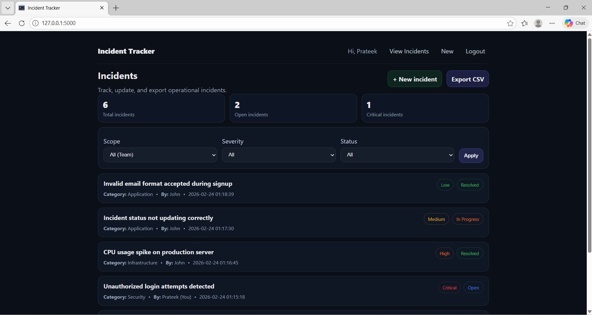
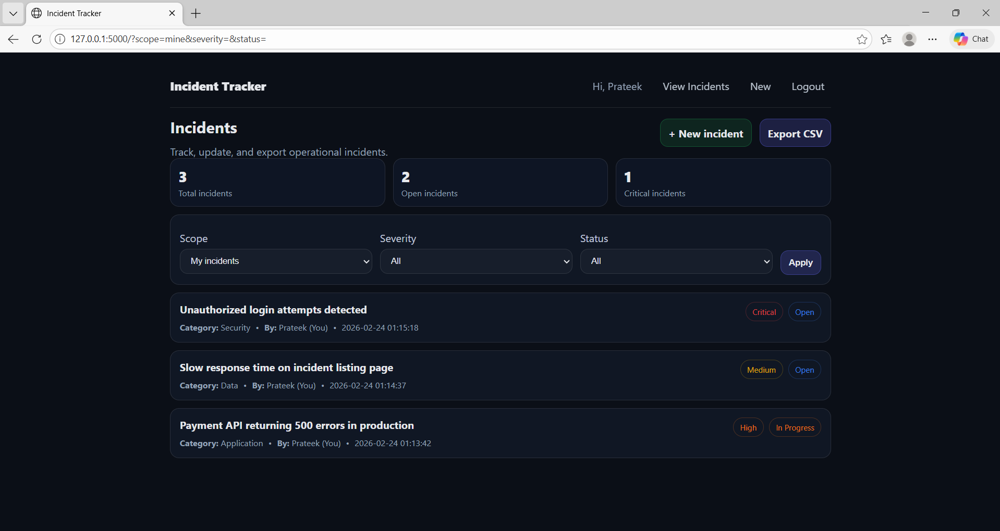
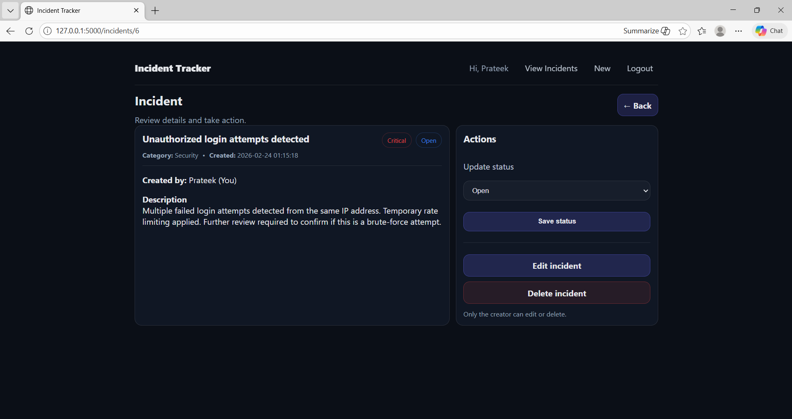
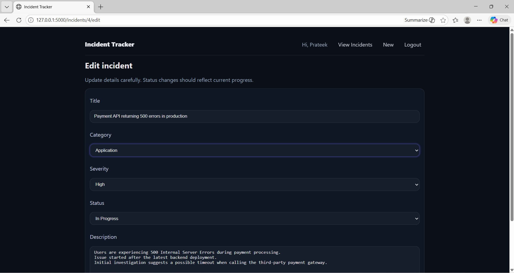
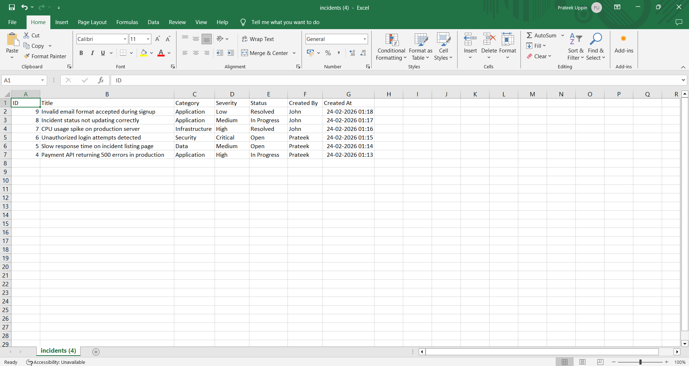

# Incident Tracker
A simple internal web tool to log, track, and report operational incidents.  
Built with Flask + MySQL, with authentication, team visibility, filters, and CSV export.

## Why this project
Spreadsheets are quick to start with, but they don’t enforce ownership, access control, or a clean incident workflow.
This app provides a shared way for a team to track incidents and export reports.

## Features
- User signup/login (passwords hashed)
- Create, view, edit, and delete incidents 
- Status workflow: Open → In Progress → Resolved
- Team visibility: view all incidents or only your own
- Filters by severity and status
- KPI summary cards (Total / Open / Critical)
- Export filtered incidents to CSV 

## Tech stack
- Python, Flask
- MySQL
- HTML + CSS

## Screenshots







## Getting started (Local setup)
1)Create a virtual environment-
```bash
python -m venv venv

2) Activate it-
Windows (PowerShell):
.\venv\Scripts\activate

3) Install dependencies-
pip install -r requirements.txt

4) Set up the database-
Create a MySQL database and tables,
example - using this SQL script:
    CREATE DATABASE incident_tracker_db;
    USE incident_tracker_db;

    CREATE TABLE users (
    id INT AUTO_INCREMENT PRIMARY KEY,
    name VARCHAR(100) NOT NULL,
    email VARCHAR(120) NOT NULL UNIQUE,
    password_hash VARCHAR(255) NOT NULL,
    created_at TIMESTAMP DEFAULT CURRENT_TIMESTAMP
    );

    CREATE TABLE incidents (
    id INT AUTO_INCREMENT PRIMARY KEY,
    title VARCHAR(200) NOT NULL,
    category VARCHAR(50) NOT NULL,
    severity VARCHAR(20) NOT NULL,
    status VARCHAR(20) NOT NULL,
    description TEXT,
    created_by INT NOT NULL,
    created_at TIMESTAMP DEFAULT CURRENT_TIMESTAMP,
    FOREIGN KEY (created_by) REFERENCES users(id)
    );

5) Update DB config-
Edit db.py and set your MySQL host, user, password and database.

6) Run the app-
python app.py
Open: http://127.0.0.1:5000